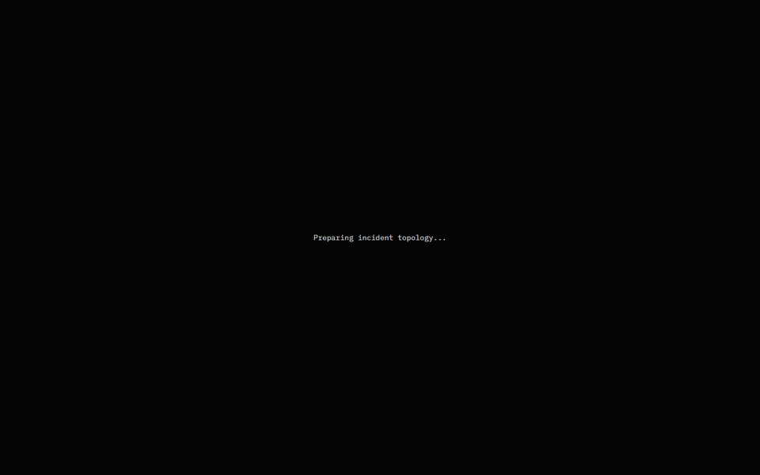

<div align="center">

# ThreatFlix

### An identity attack should look like a story, not a pile of logs.

[](https://github.com/scienstien/threatFlix/releases)
[](Backend/)
[](FrontEnd/)
[](ML/)
[](https://pypi.org/project/threatflix-ueba/)
[](https://github.com/scienstien/threatFlix/pkgs/npm/threatflix-sdk)

**A student-built, explainable identity-threat investigation system.**

</div>

---

## The Story

Security telemetry is very good at telling you that *things happened*.

A login failed. Then another failed. MFA was rejected. A login succeeded. MFA was disabled. A new API
key appeared. Data left the system.

Every event is individually understandable. The hard part is recognizing that together they describe one
attack, deciding which parts are facts, and explaining the result without asking an LLM to invent the
truth.

That is the question behind ThreatFlix:

> Can we turn an identity attack into an investigation that an analyst can inspect, challenge, and
> understand?

ThreatFlix begins with raw telemetry and deterministic evidence. Those facts create the investigation.
Behavioral ML can refine its urgency. Graph similarity can find earlier incidents with the same shape.
A local LLM can explain the case and answer questions. None of those supporting layers are allowed to
quietly rewrite what happened.

## Watch The Attack Assemble

The topology explorer is lazy-loaded only when an analyst asks for it. Every node and directed
relationship shown below comes from persisted raw telemetry.

<div align="center">
  
</div>

The graph is not decoration. It gives the analyst a way to move from:

```text
failed login -> successful login -> MFA disabled -> privilege change -> persistence -> export
```

to a visual answer for:

- Which identity was involved?
- Where did the activity originate?
- Which events belong to the same session?
- What service was targeted?
- Have we seen an incident with this structure before?

## The Design Bet

ThreatFlix deliberately separates **authority** from **assistance**.

| Layer | What it contributes | What it cannot do |
| --- | --- | --- |
| Deterministic investigation engine | Evidence, attack chain, classification, initial risk | Hide behind an opaque model |
| UEBA ensemble | Behavioral anomaly context and bounded score refinement | Create an investigation by itself |
| Graph similarity | Earlier incidents with structurally similar progression | Claim common attribution |
| Local LLM | Incident narrative, recommended actions, analyst chat | Change the evidence or risk score |

That boundary is the project. The models are useful because they have somewhere honest to stand.

For the mathematics, scoring logic, architecture, evaluation boundaries, finances, and roadmap, read the
[ThreatFlix V1 Technical Wiki](docs/wiki/Home.md).

## What The Analyst Sees

ThreatFlix gives the SOC analyst one case workspace instead of four disconnected tools:

- **Raw telemetry first**, because the source events remain the ground truth
- **Deterministic evidence**, including the rules and attack-chain transitions that created the case
- **Behavioral context**, showing why this session differs from the identity's baseline
- **Incident topology**, progressively revealing the persisted provenance graph
- **Similar incidents**, comparing attack structure even when identities and IP addresses differ
- **Interpretation report and chat**, grounded in a frozen, bounded incident context

## A Very Important Reality Check

ThreatFlix is currently a **student project and research-grade demo**, not a hosted security product.

There is no public ThreatFlix backend waiting patiently on the internet. Cloning the frontend and clicking
around will not summon a production SOC platform from the void. You need to run the backend, model
service, database, and optional Ollama layer locally.

Could we host and operate it properly? Certainly.

Would you like to fund the backend? The server has reviewed the proposal and is extremely supportive.

Until then, treat ThreatFlix as an explainable architecture demonstration: reproducible, inspectable, and
promising, but not something to place between your company and an actual attacker on a Friday evening.

## Run The Demo Locally

You need Bun, Node.js/npm, Python 3.12 with `uv`, and optionally Ollama.

For the full judge flow, start the isolated Northstar customer, ThreatFlix, and the trained UEBA sidecar:

```powershell
cd JudgeDemo
.\start_demo.ps1
```

Northstar starts disconnected on purpose. Open `http://127.0.0.1:5173/integration`, generate a
tenant-scoped key, place it in `JudgeDemo/threatflix.ts`, and then run:

```powershell
python attack_runner.py --scenario all --delay 0.25
```

The runner calls only Northstar application endpoints. ThreatFlix receives the resulting SDK telemetry,
creates deterministic investigations, enriches them with UEBA, and generates graph fingerprints.

For the seeded investigation workspace without the live integration walkthrough:

```powershell
# Terminal 1: runtime UEBA service
cd Backend/models/service
uv sync
uv run uvicorn app:app --host 127.0.0.1 --port 8001

# Terminal 2: backend and reproducible attacked customer
cd Backend
npm install
Copy-Item .env.example .env
# Set JWT_SECRET in .env
npm run seed:demo
npm run dev

# Terminal 3: frontend
cd FrontEnd
npm install
npm run dev -- --host 127.0.0.1
```

Open `http://127.0.0.1:5173/dashboard`.

Demo account:

```text
email:    demo.customer@threatflix.local
password: ThreatFlixDemo!2026
```

The seed recreates a normal identity baseline, an active multi-stage takeover, historical comparison
incidents, graph fingerprints, UEBA enrichment when available, and an example analyst report.

## Release Notes

### `1.0.0` - Explainable Investigation System

`1.0.0` changes ThreatFlix from an alert-oriented prototype into a complete investigation experience.

**What improved**

- Replaced LLM-led detection with a deterministic investigation authority
- Added identity-focused evidence rules, correlation, attack stages, and chain scoring
- Added a reproducible 21-feature UEBA pipeline and promoted runtime ensemble
- Added bounded ML fusion so behavioral scoring cannot overrule deterministic evidence
- Added canonical incident graphs and Weisfeiler-Lehman structural similarity
- Added cross-incident topology comparison
- Added local Ollama incident reports and source-grounded SOC chat
- Redesigned the dashboard around raw telemetry and deterministic evidence
- Added an animated, lazy-loaded provenance graph explorer
- Added a reproducible demo customer under active attack
- Expanded automated coverage across the backend, ML workspace, and runtime model service

**Known limits**

- Synthetic UEBA training and evaluation data
- Fixed IST work-hour assumption
- SQLite persistence and local-only deployment
- Batch-trained anomaly models
- Local Ollama without production model governance
- No hosted backend, despite the frontend looking rather ready to have one

### `v0.0.1` - Prototype

The first release proved the basic loop:

```text
SDK event -> backend -> alert -> dashboard
```

It established event ingestion, authentication, SQLite storage, alert presentation, and the first demo
scenarios. Detection and explanation were still tightly coupled to an LLM-oriented prototype, with no
deterministic investigation authority, behavioral model, incident graph, or similarity layer.

## Where To Go Next

- [Technical wiki](docs/wiki/Home.md) - mathematics, architecture, evaluation, finances, and roadmap
- [Backend](Backend/) - deterministic investigation engine, persistence, APIs, graph layer, and LLM context
- [Offline ML workspace](ML/) - reproducible UEBA training and evaluation
- [Published UEBA runtime](https://pypi.org/project/threatflix-ueba/) - installable promoted artifact scorer
- [Runtime ML service](Backend/models/service/) - packaged runtime source and compatibility service
- [Frontend](FrontEnd/) - analyst investigation workspace
- [SDK](SDK/) - source for the published `@scienstien/threatflix-sdk` event capture client
- [Judge demo](JudgeDemo/) - reproducible Northstar integration and attack flow
- [Releases](https://github.com/scienstien/threatFlix/releases) - version history

## Project Philosophy

The most important output of a security system is not a score.

It is a defensible answer to:

> What happened, why do we believe it, and what should the analyst do next?

ThreatFlix `1.0.0` is our attempt to make that answer visible.

---

<div align="center">

Built as a student project. Serious about explainability. Open to backend benefactors.

</div>
